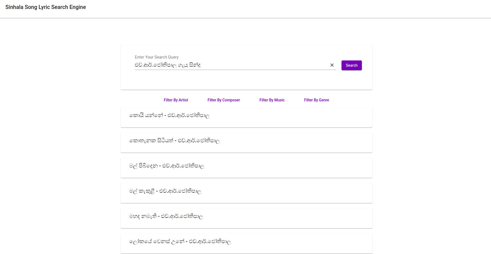
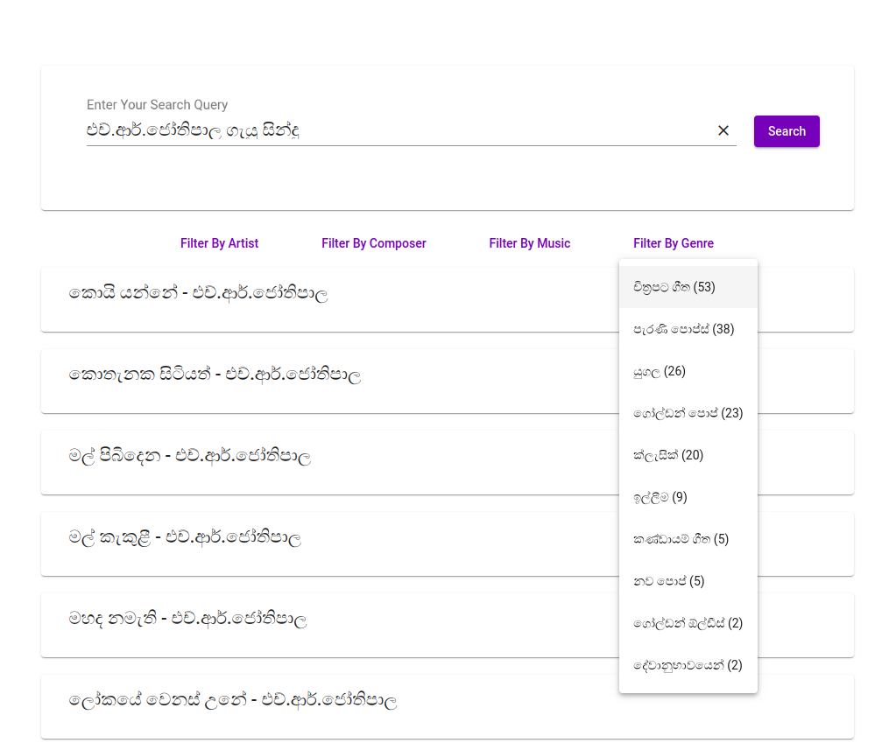
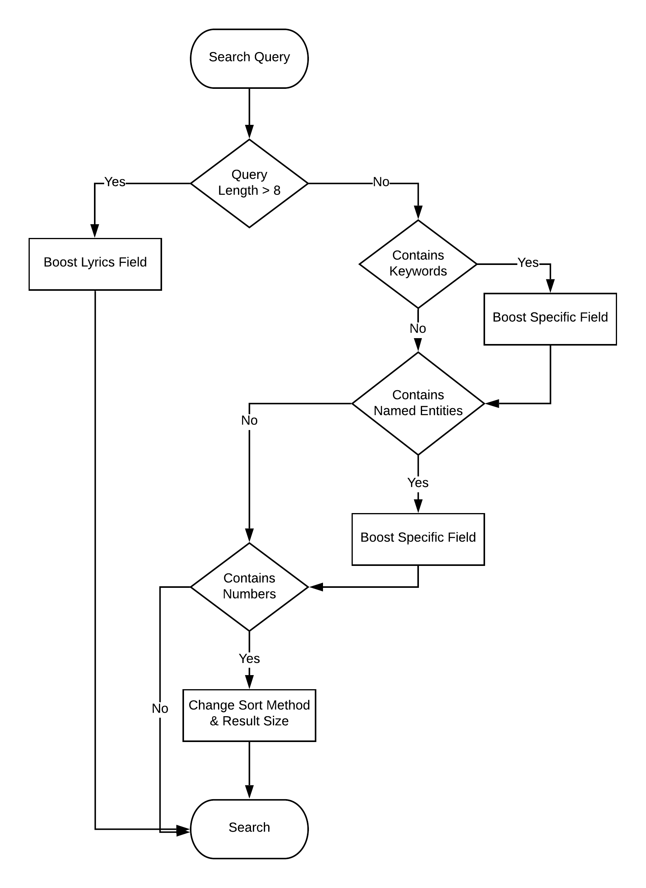

# Sinhala Song Search Engine
A project done for module CS4642 - Data Mining &amp; Information Retrieval

## Introduction



This repository contains the source code for a Sinhala Song Search Engine developed using [Scrapy](https://scrapy.org/) as the scraping framework, [ElasticSearch](https://www.elastic.co/) as the search engine, and [NodeJS](https://nodejs.org/en/) and [Angular](https://angular.io/) as the web frameworks.

The search engine contains about 1000 sinhala song lyrics in sinhala letters. The songs were scraped from [Sinhala Songbook](https://sinhalasongbook.com/). The search engine offers following features for the users.

1. Searching songs using the Title, Lyric, Artist, Genre, Composer, Movie, Beat, Key, and Music.
2. Spell correction support.
    * අමරදේ හොදම සින්දු, අමරදේව හොදම සින්දු will give the same result as අමරදේවගේ හොදම සින්දු.
3. Faceted search.
    * Users will be able to filter their search results based on Artist, Genre, Composer, and Music.
4. Range search.
    * Users will be able to get a specific number of best matching results.
        * අමරදේවගේ හොදම සින්දු 10 will display the 10 most viewed songs of අමරදේව.
5. Query classification to boost the results.
    * Search engine is able to scan and identify special words like 'ලිවූ', 'රචිත', 'ලියපු' in the query to weigh the search towards composers.

## Project Structure
```
|___data - contains the data files
    |___keywords.json - contains the keywords needed when doing query classification
    |___named_entities.json - contains artist, composer, music, genre, movie names for query classification
    |___original_data.json - contains the original data scraped from web
    |___formatted_data.json - contains the formatted version of original_data
|___elasticsearch
    |___collect_named_entities.js
    |___index_data.js - contains the indexing and mapping queries related to elasticsearch
|___search-engine-back - back end system
    |___routes
        |___search.js - contains the search query with all the classification, boosting mechanisms
|___search-engine-front - the front end UI of the system
|___song_lyric_crawler
    |___song_lyric_crawler
        |___spiders
            |___crawler.py - the crawler used to scrape data from web
```

## Details about the Dataset

* artist - the artist of the song
* shares - the no. of shares of the song
* formattedLyrics - the lyrics with linebreaks for display purpose
* unformattedLyrics - the lyrics with linebreaks removed for searching
* title - title of the song
* url - the link to the original webpage of the song
* viewCount - the no. of views to the song
* beat - the beat of the song
* composer - the music provider
* genre - the genre of the song
* key - the key of the song
* writer - the song writer's name
* movie - the movie which the song was played in

## Prerequisites

* ElasticSearch v7.8.0
* Kibana v7.8.0 (Optional)
* NodeJS v11.12.0
* Angular v8.3.23

## How to Setup

1. After downloading ElasticSearch, install ICU Analyser plugin by running ```sudo bin/elasticsearch-plugin install analysis-icu``` in order to activate the ICU Tokenizer
1. Start an ElasticSearch instance on port 9200
2. Start a Kibana instance if you need to view the indexes
3. Run `npm install` followed by `node index_data.js` inside elasticsearch directory to create the index and index the songs
4. Run `npm install` followed by `npm start` inside search-engine-back directory
5. Run `npm install` followed by `ng serve` inside search-engine-front directory
6. Open the browser and goto `localhost:4200`

## Used Techniques

### Tokenization

[ICU Tokenizer](https://www.elastic.co/guide/en/elasticsearch/plugins/current/analysis-icu-tokenizer.html) is used to tokenize text into words on word boundaries. It is like a standard tokenizer, but it have better support for Asian languages.

And also N-gram tokenization is used to correctly map the user input to the relative fields. For N-gram tokenization, [Edge n-gram tokenizer](https://www.elastic.co/guide/en/elasticsearch/reference/current/analysis-edgengram-tokenizer.html#analysis-edgengram-tokenizer) which is a built in text alayzer in ElasticSearch is used. Here, the edge_ngram tokenizer first breaks text down into words whenever it encounters one of a list of specified characters, then it emits N-grams of each word where the start of the N-gram is anchored to the beginning of the word. The `min_gram` is specified as 4 here and `max_gram` is specified as 18. As an example, 

    කරුණාරත්න අබේසේකර ලියපු සින්දු will be broken down into, කරුණාර, කරුණාරත්, කරුණාරත්න, අබේසේක, අබේසේකර etc.

With this, search engine can easily map user input to correct words even if the user misses some characters in the word.

### Stop Token Filtering

Another filter used is the [Stop Token filter](https://www.elastic.co/guide/en/elasticsearch/reference/current/analysis-stop-tokenfilter.html#analysis-stop-tokenfilter-stop-words-by-lang) which removes stop words from a token stream. Originally it is designed to remove english stop words. But it has been customized here to remove some sinhala stop words.

### Field Boosting

This is a technique used to boost individual fields such that they count more towards the relevance score at the query time. The search query is scanned by the backend prior to sending to ElasticSeach to identify specific words like `ලියන`, `රචිත`, `ලියපු`, `ගායනා`, `ගායනා`, `ගැයු`, `වර්‍ගයේ`, `වර්ගයේම`, `වර්ගයේ`, `ජනප්‍රිය`, `ප්‍රචලිත`, `ප්‍රසිද්ධම`, `සිංදු`, `ගී` and the relevant fields are boosted according to the query. As an example,

    If the user enters `අබේසේකර ලියපු සින්දු`, the backend will identify the word `ලියපු` and will identify that the user is searching for songs that a certain composer has composed. Therefore, when searching, the composer field will be boosted more than other fields.

### Facets/ Aggregations

When querying, backend asks for results and also the counts of results aggregated with certain fields. So the user can filter the results based on those fields.



## Program Flow


